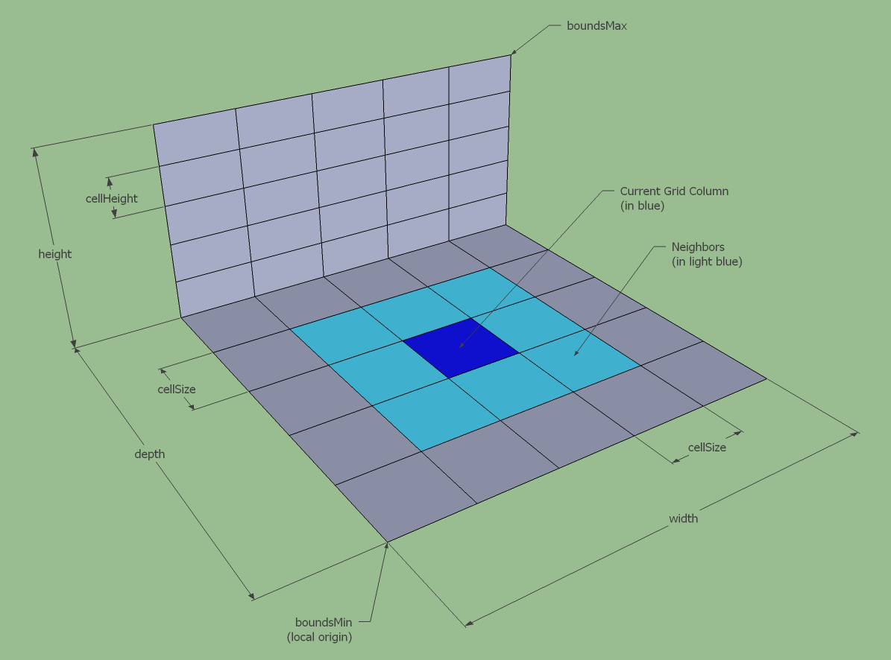

## 高度域介绍
为了后面理解 nav mesh 的生成，首先需要理解 高度域是如何表示体素信息的

高度域提供了一种不错的数据结构来表示 几何体的上表面

---

### 高度域结构
下图是一个欧几里得空间下的轴对齐盒，通过 最小点 和 最大点 进行描述

将 盒子 切分成 x和z一样的柱状

按照一定的高度间隔再进行切分，现在最初的box被切分成了xyz轴向对齐的小box，这个小box就是体素，voxel

---
### 高度区
每个column有一串体素构成，每个体素不是障碍物，就是开放域 （原文用 solid 和 open 来表示）

通常我们只关注 solid area，所以为了描述起来更加简洁，会把一个column中连续的 solid voxel 合并成一个 solid span

下面是一整个heightfield的全景，红色部分就是障碍区（即 solid voxel）

---
### 开放区 Open Span
虽然上面得到了 solid heightfield，许多算法也是基于这个的。但是对于 生成navmesh 来说，最为重要的是每个solid span之外的空间，也就是 open spans

这里着重强调，open heightfield 不是直接把 solid heightfield 取反就可以的。如果一个 heightfield 没有任何 solid span，也不会有任何 open span，每个column中最低的solid span的下方空间将被忽略，上方才会被考虑

所以基于这个思路，open span通常有如下情况
- 当前solid span的上表面 和 上方另一个solid span的下表面，构成一个 open span
- 如果上方没有另外一个solid span，那么 open span的上边界就是任意值（无穷大呗）

### 小总结
heightfield中的voxel数据如下表示
1. field 的AABB 表示法
2. xyz 三个方向的分辨率（步进值）
3. 每个 column 的子结构，来描述 span （包括了 solid 和 open 的）
4. span 包括了 solid 和 open 的
（这部分建议直接看源码会容易理解）

### 其它
相邻搜索 （后面会用到），遍历周边的column，遍历每个column中的span

column层面的neighbor如下图

span层面的neighbor如下图，只有足够接近的span才可能被当做neighbor。只有 Open Heightfield 的实现会有 SearchNeighborSpan 的方法 （这个直接看代码呗）

轴相邻就是四个偏移咯 (-1,0) (0,1) (1,0) (0,-1) ，逆时针的顺序

如果要把角相邻也算上的话，就是 (-1,0) (-1,1) (0,1) (1,1) (1,0) (-1,1) (0,-1) (1,1)
这个搜索顺序不是必然的，视具体情况

