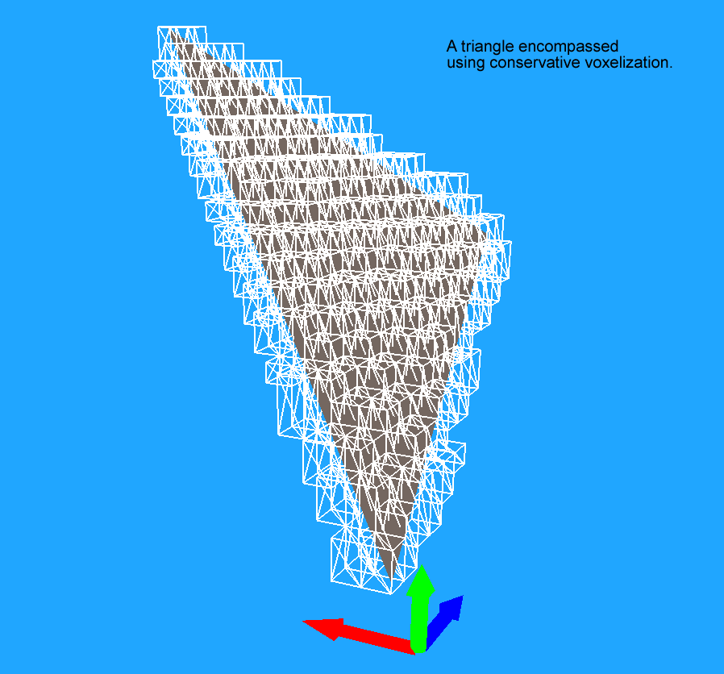
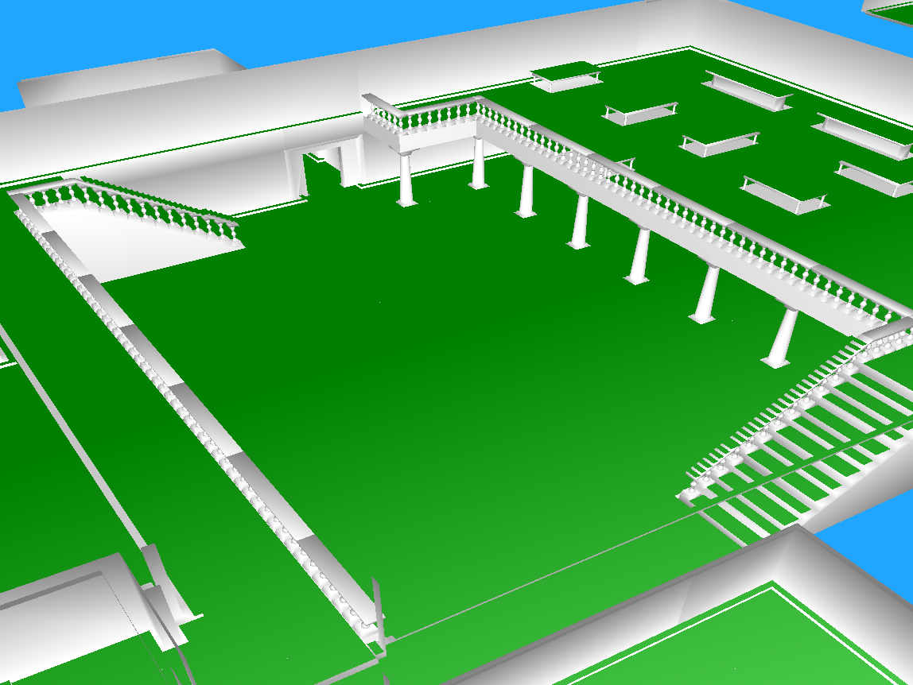
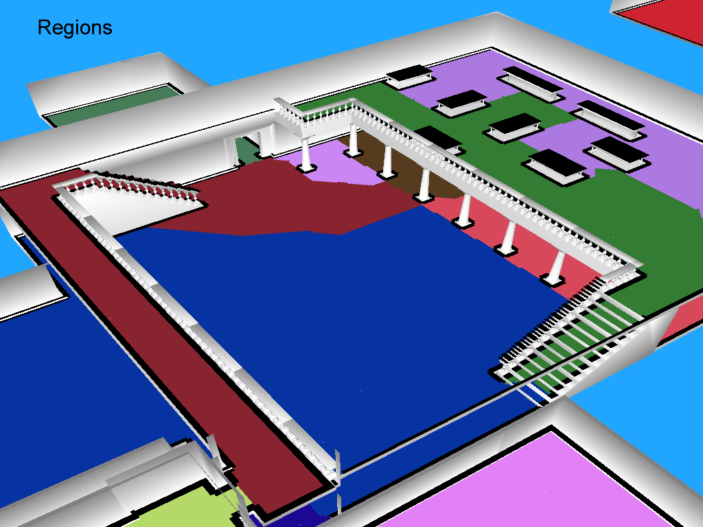
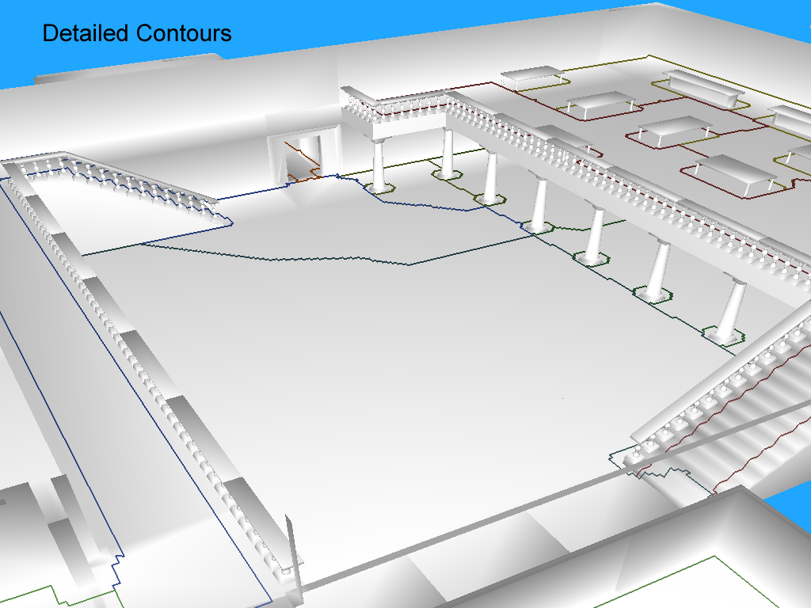
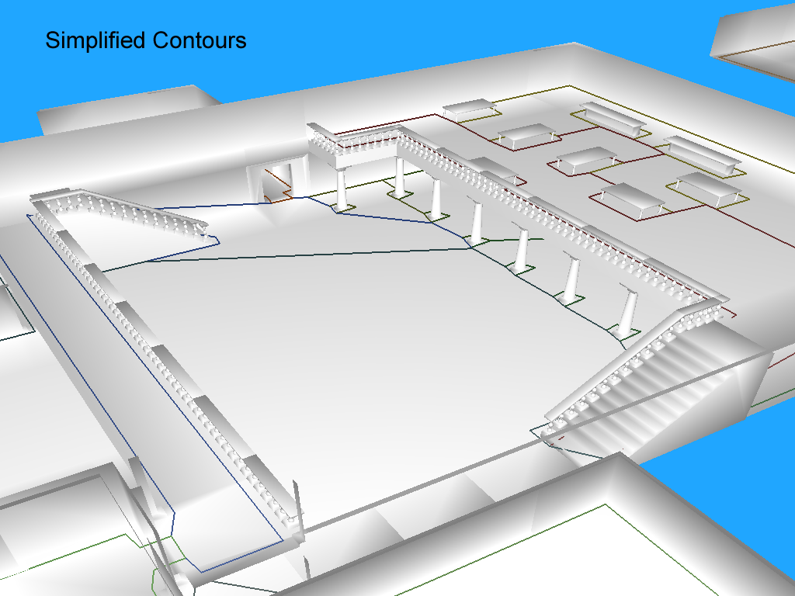
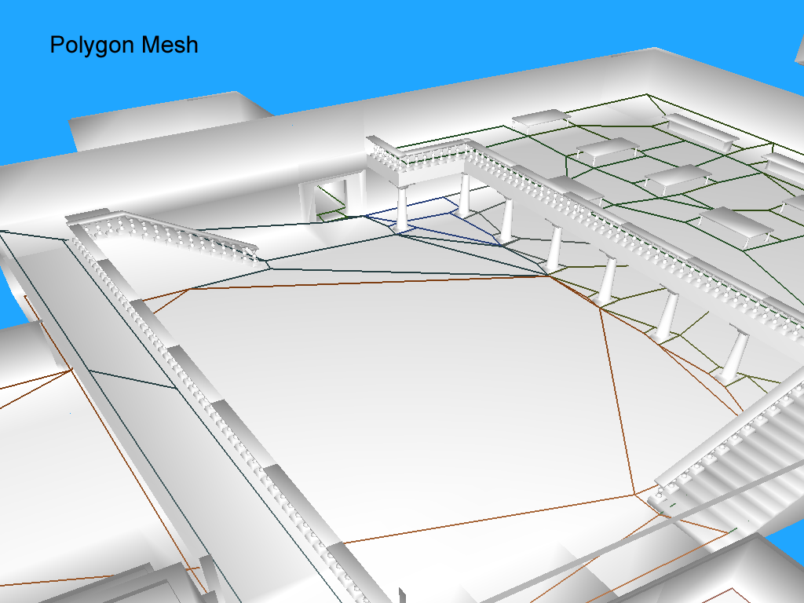

## 上层主流程
这篇将了创建 navigation mesh data 的上层主流程 （对应到代码的类是 NavmeshGenerator）

主流程如下
- 体素化 Voxelization - 将原始的几何体，转化为一个 solid heightfield
- 创建 regions - 检查solid heightfield中所有的上表面，并将每个solid span 分配到各自的region中（每个region是一系列连续span）
- 创建 contour - 检查每个region的轮廓，并形成简单多边形
- 创建 Polygon Mesh - 将上一个步骤中创建的多面体，进一步切分成凸多边形
- 创建 Mesh - 将上一个创建的多边形三角化，并添加高度信息

---
### 体素化
体素化过程中，几何体会被抽象成一个 heightfield，然后一些初步的剔除逻辑会执行

几何体中的每个三角形都会被体素化，使用的是 conservation voxelization，并添加到 heightfield 数据中
- Conservative voxelization 是指所有多边形表面都会被体素完全包围的算法

下面是一个三角形的体素化结果

体素化后，solid heightfield 就包含了所有的覆盖几何体的 solid spans

一旦体素化完成后，会对这些spans进行 traversable 的标记，判断准则如下：
- span的上表面 和 其上方span的下表面 是否保持了最小距离  （否则空间太矮，走不过去）
- 由连续span的上表面构成的坡 是否小于 坡度预设 （否则爬不动）
- 相邻span允许的高度差 （台阶表面）

---
### 创建 Region

这一步的目标是确定哪些 solid surface是可行走的，同时将他们分配到对应的region中，由此生成后面的多边形

首先，将 solid heightfield 转换为 open heightfield
- open heightfield 是指 solid span 上方的潜在可行走区域

下面的例子中，绿色区域代表了 open spans 对应的 floor
- 这个floor 就是 solid heightfield 中 traversable solid spans 的上表面

注意，类似 墙体、桌面下方、窄区域不是绿色的，这部分在 solid heightfield 的生成阶段就被剔除掉了

但是，桌面、楼梯扶手等区域（时机不可走），现阶段还是认为是 可行走的

下面，进一步找出那些不能行走的区域。之后通过下面的所有测试，才会认为 open span 是合格的：
- span 不能太靠近障碍物，如墙体
- span上方要有足够的空间，否则走不过去 或者 站不直

neighbor信息 会针对所有 open span进行生成，后续进行region划分的时候会用到。neighbor判断会考虑上表面的垂直距离（距离超出配置就不能算相邻， 这样就能很容易的区分台阶和桌面）

neighbor信息 配合 分水岭算法（watershed algorithm），会生成初步的region划分。后续会进行一定的优化，如 合并\剔除掉非常小的region

下图是一个region划分的结果，注意如下点
- 楼梯台阶被连接上了
- 桌面、扶手等表面被干掉了

现在，可行走表面 可以使用这些 region 表示

---
### 创建 Contour

region的边界会被溜达一遍，形成一个最基本的多边形。这是把 voxel space 转换回 vector space 的第一步

首先，通过region生成高精度的多边形，如图所示

然后，一系列算法将出马，完成下面一系列目的：
- 简化两个多边形之间的边界 （比如一条锯齿就可以用一条直线表示）
- 保证和障碍物隔离的edge，不进行任何操作
- 优化边界的长度（太长的话，对后面三角化不利）

下图展示了各种简化算法操作之后的结果

---
### 创建 Convex Polygon
因为许多算法只能被用在凸多边形上，所以这一步就是将 上面用contour描述的简单多边形 拆分成 凸多边形

这里通过三角化进行实现，然后再将拆分出来的三角形合并成一个可能的最大凸多边形

下图可以看到效果，从 contour 转换到 一堆凸多边形

这一步过后，可行走表面就是由 一堆凸多边形的网格进行表示的了

---
### 创建 Detailed Mesh
最后一步，将使用 Delaunay triangulation算法 来三角化，所以高度的细节可以被添加进去