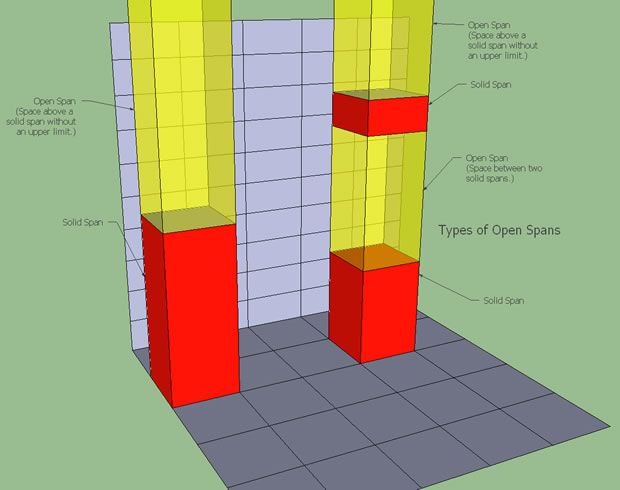
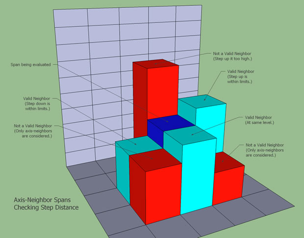
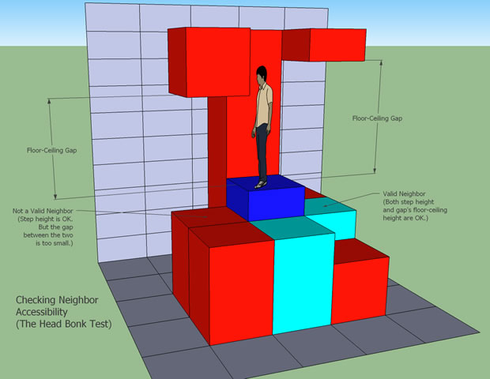
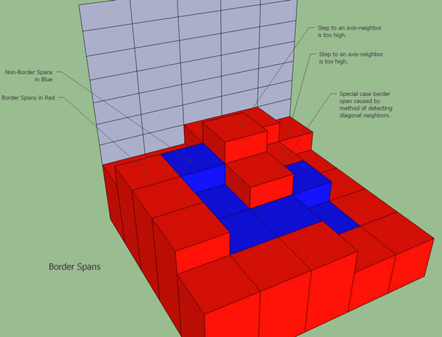
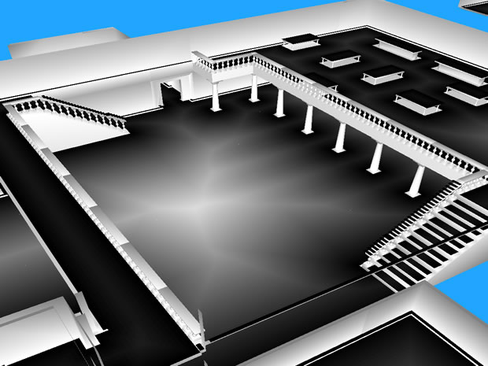
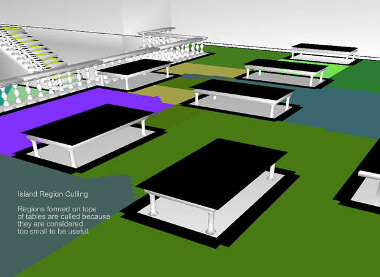
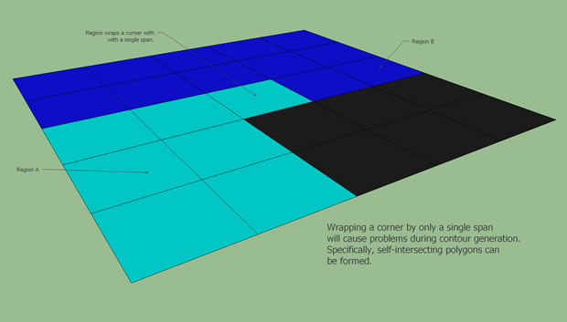
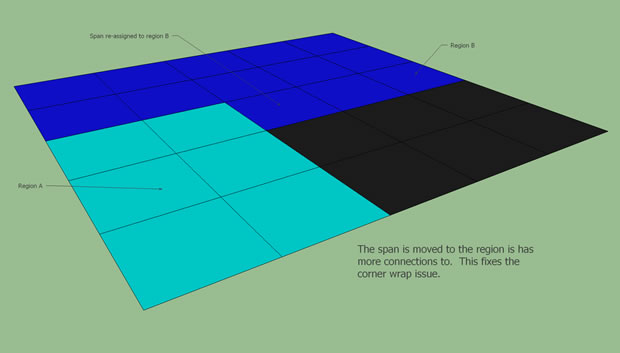
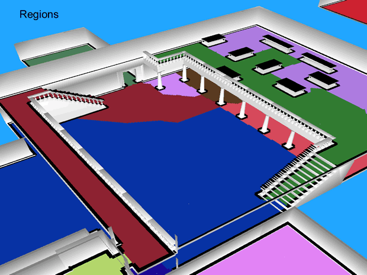

# Region Generation
这一篇将会描述"构建导航网格"的第二个阶段，构建可行走区域表面的过程

```
solid span 相比 open span 通常看起来会更加直观一些，所以后面的图面中，显示较多的是 solid span
但是下面涉及到的算法中，open heightfield 比 solid heightfield 更多
```
---
## 创建 Open Heightfield
正如之前对 heightfield 的介绍，open heightfield 代表了 solid heightfield中所有 solid span上面的那部分空间

创建open heightfield相对来讲还是比较简单的

遍历所有的solid span，如果span被先前标记了“可行走”，那么当前span的上表面和它上方span的下表面，共同构成了一个 open span
如果当前span的上方没有span，那么可以认为新创建的 open span 的上表面是无穷大

这一对新创建的 open spans 就组成了 open heightfield


---
## 创建 Neighbor Links
上面得到的 open heightfield 目前还只是一些互相无关的 open spans

下一步就是找出 哪些表面可以组成连续的span，这就是通过前面提到的轴相邻的方式

遍历轴相邻的四个column中的所有span，如果满足下面的条件，那么认为这两个spans是相邻的
- 高低差（即两个span的上表面高低差）不超过预设值（如 maxTraversableStep）

- 两个spans上方的高度是否足够大，即从一个span走到另外一个span上，会不会磕脑袋


这里只处理的轴相邻的四个column中的span，并没有涵盖四个角上相邻的column。如果需要的话，也可以用上

---
## 创建距离场 Distance Field
距离场中的距离是指 当前位置到最近边界的距离。这个信息会在后面 构建region 的时候使用到

少于8个neighbor span的span都称作 border span （也就是上面说的边界），这个边界就是 可行走区域 和 障碍物/空白区 之间的边界



---
## 创建 region
到这里，所有为了创建region所需要的准备工作都已经完成了

region 就是连续span的上表面构成的区域。投影到xz平面之后，就形成一些简单地多边形

region的初步创建会使用 分水岭算法 (watershed algorithm) ，距离值（也就是和边界的距离）越大，在算法中用低点表示 （最先被水淹过呗）。反之，边界就是水位最高的点

在主循环中，从最低的水位开始，逐渐增长水位，一直到最高水位。遍历过程中，最先淹过低点，然后随着水位的增长，扩大已有的水域 或者 增加新的水域

分水岭算法不是完美的，会有一些边界问题处理不了，所以还会做一些优化，如
- 非常小的region会被直接扔掉，比如桌子的表面

- 非必要的小区域会被合并掉，比如小凹坑
- 如果某个region对一个无效区域形成了包围形态，会进行拆分（拆出一个新的region 或者 拆出一部分算到相邻的region中）
    - 如果不这么做，在生成region轮廓的时候会自交



---
## 最后
经过上面一系列步骤，最后将场景划分为如下多个 region

