# 生成 Contour
这一篇讲述建立NavMesh的第三个阶段，构建一系列简单多边形（凸多边形、凹多边形）来表示原始几何体的可行走表面

这里的Contour，也就是轮廓，依然是基于体素空间，这是从 体素空间 转向 矢量空间 的第一步

---
## Searching for Region Edges
从 heightfield 到 contour，最大的概念上的转变就是 关注点从 span surface 转移到了 span edge

对于 Contour，关注的是 span edge。这里会有两种类型的edge
- region edge 是指两个不同region之间的边界
- internal edge 是指同一个region内部的两个子区域的边界

下面的各种例子将会基于2D来解释，看起来方便些，后面会回到3D空间
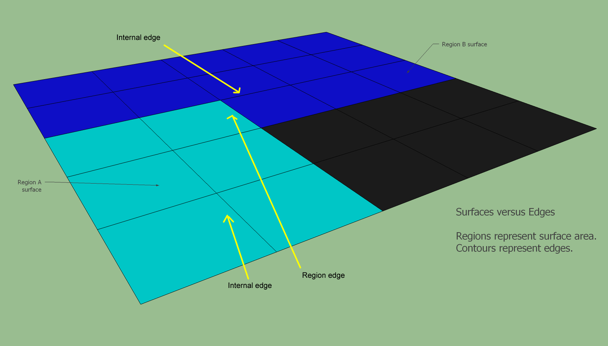

这一步，会将edge的类型进行区分，region edges / internal edges

这个比较容易处理，遍历所有的span，检查 axis-neighbors，如果neighbor不是在同一个区域的，那么这两个span之间的边就是 region edge
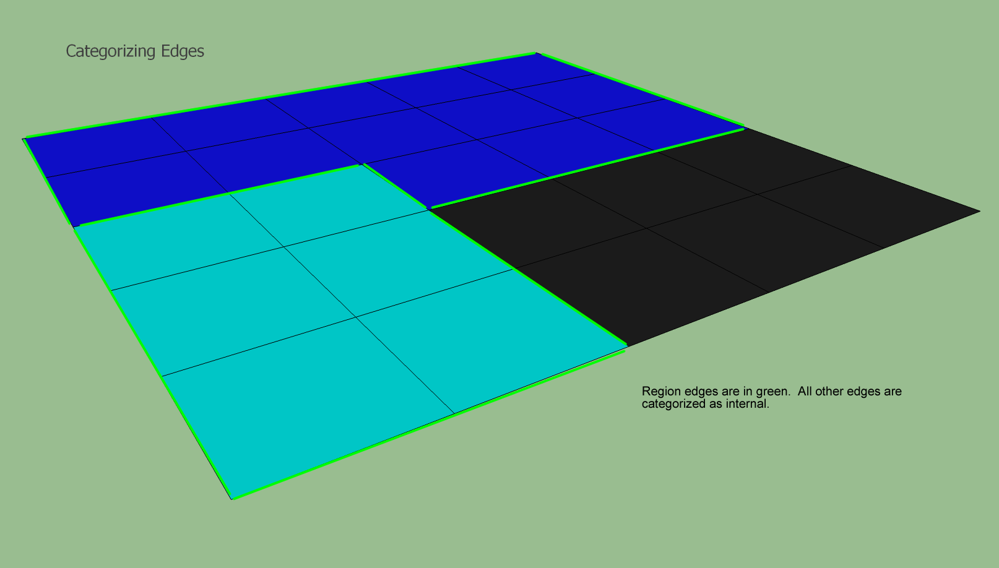

---
## Finding Region Contours
经过上一步的处理之后，现在有了每个span edge是不是region edge的信息，接下来构建 Contour 就可以基于这个信息

遍历所有 spans，如果span有一个 region edge，就进行如下操作：
1. 面向已知的 region edge，添加到 Contour 的数据结构中
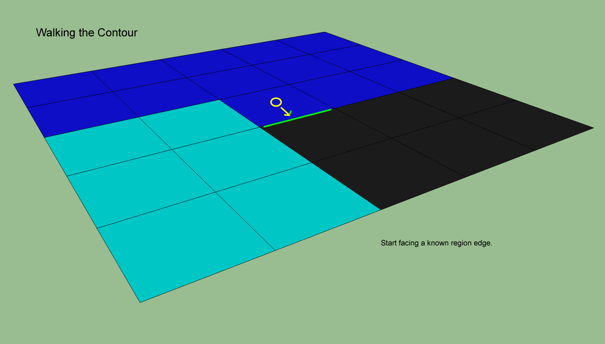

2. 顺时针旋转90°，如果指向的还是region edge，那么添加到 Contour 中，如果指向的是 internal edge，朝着指向前进一格

3. 上一步前进之后，逆时针旋转90°，如果指向是的 region edge，那么添加到Contour中，同时重复第2步的操作。 如果指向的是 internal edge，朝指向前进一格

其实就是反复上面第2、3步，指向region edge就顺时针转90，如果指向internal edge，就前进一格后逆时针转90，继续判断edge类型，反复如此，一直回到最初的span 和 最初的朝向 为止

---
## Moving from Edges to Vertices
事实上，为了将数据从 体素空间 带回到 矢量空间，我们需要的是顶点，而不只是edge

这里(x,z)的坐标很容易获取，对每个edge，直接取corner的数据就好了 （因为corner的数据也是会预先存在span里面的）
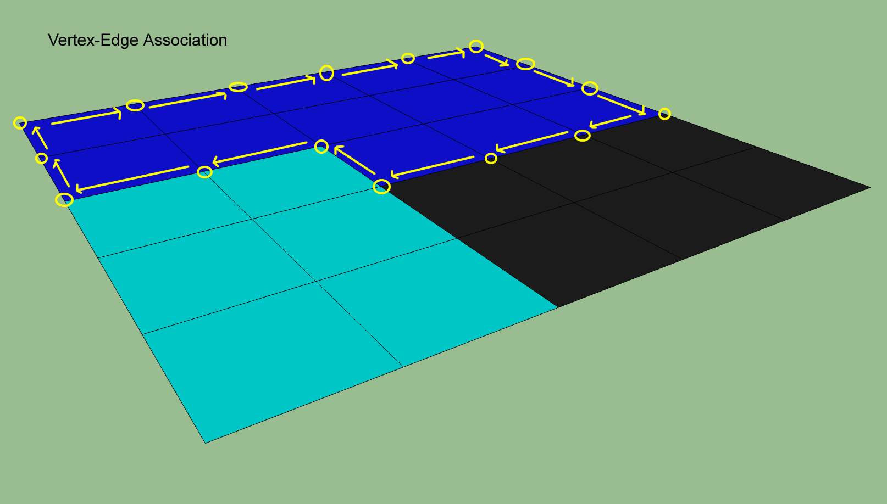

取y值的话就会有个小细节，如下图所示，y值最多会有四个潜在的值
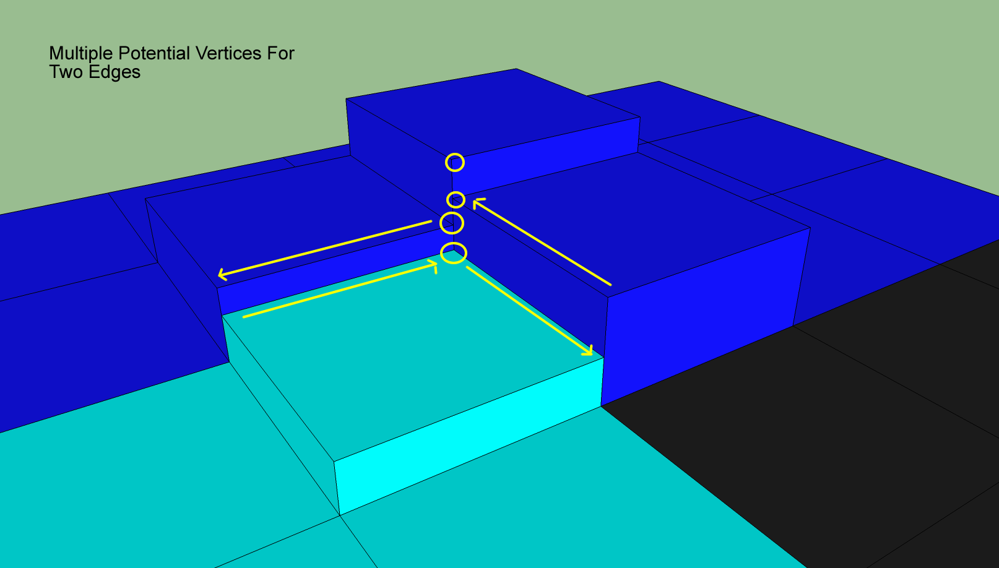

这里会直接采用最大的y值，原因如下
- 保证了这个位置最终的顶点(x,y,z) 一定是高于 原始物体在这个位置的顶点
- 统一标准
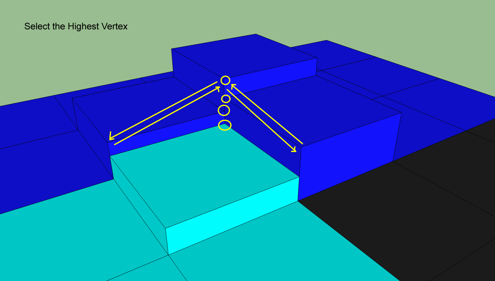

---
## Simplifying the Contours
此时，所有region的contour已经构建好了。这些轮廓都是由上一步中，从span的corner中采集到的顶点构成。下面是一张宏观的图

注意，有两种类型的 contour
- 两个相邻 region 之间的 contour
- 和 无效空间 之间的 contour （其实就是一块可行走区域的边界）
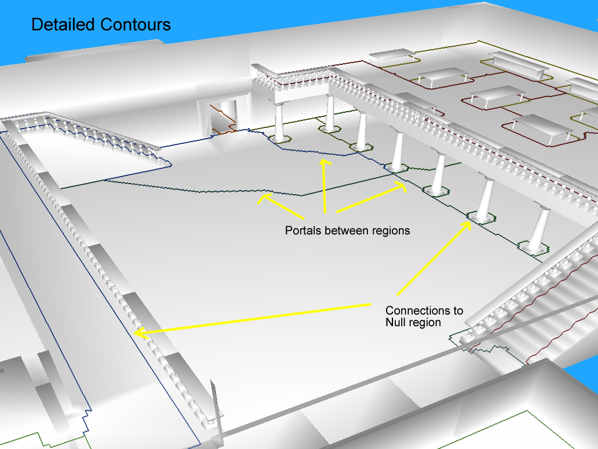

我们真的需要这么多顶点吗？即使是一条直线轮廓，也会导致每个span都要指定一个顶点。所以答案一定是否定

唯一真正需要顶点的地方就是 多个region的交界处
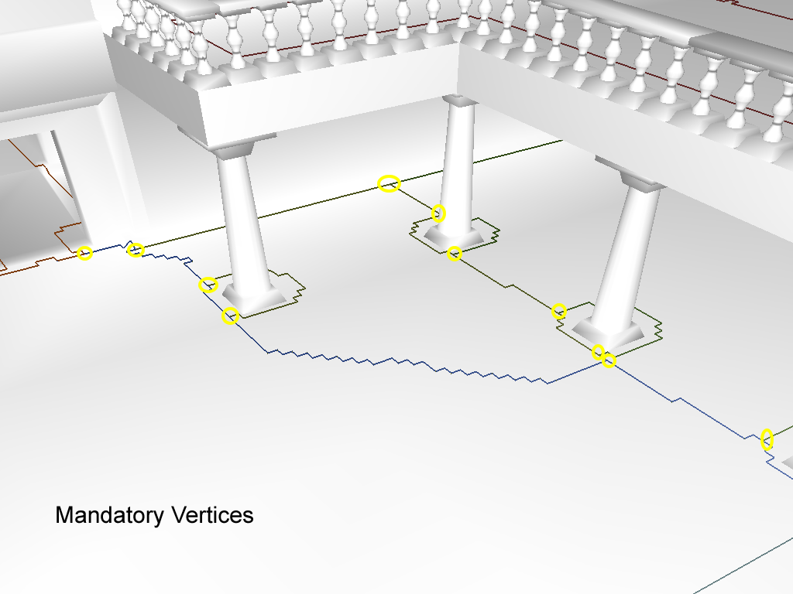

region-region之间的edge优化相对简单，除了必要的顶点，丢掉剩下没有用的顶点
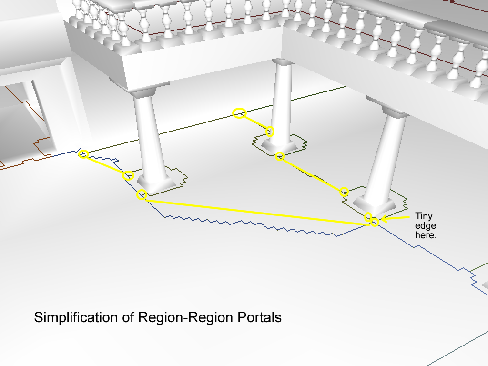

region-null之间的edge优化就相对复杂，有两种算法被使用
### Douglas-Peucker 算法 （对应代码 MatchNullRegionEdges）
目标：保证原始边界上的顶点 和 优化后边界上的顶点 不超过最大偏差  （至于这个偏差具体定多少，就是顶点数量和精度之间的权衡了）
实施步骤如下：
- 从最理想的edge样式开始 （就是一条直线）
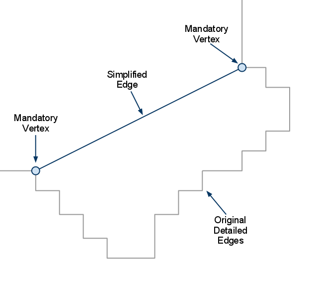

- 找到离当前edge最远的点（原始边界上的点），检查是不是超过了预设值，如果超过的话，把这个原始顶点加回来
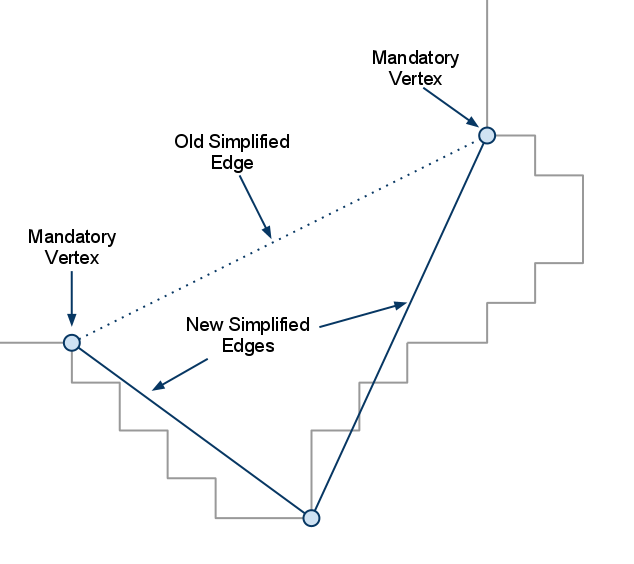

- 重复上述操作，一直到最远的顶点不超过预设值了，则结束
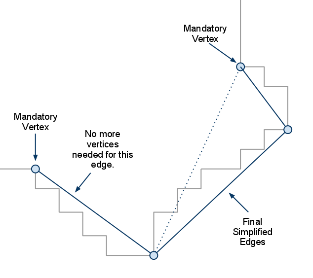

简化后的结果如下
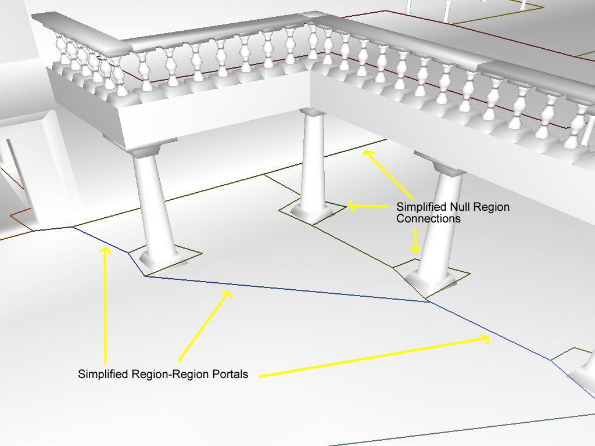

正如之前说的，另外一个算法是用来处理 region-null 之间的edge的

第一个算法可以生成长线段的edge，后续可以生成瘦长型的三角形

第二个算法是在已有的edge线段中点上插点 (NullRegionMaxEdge)，下面是优化前后的两张图
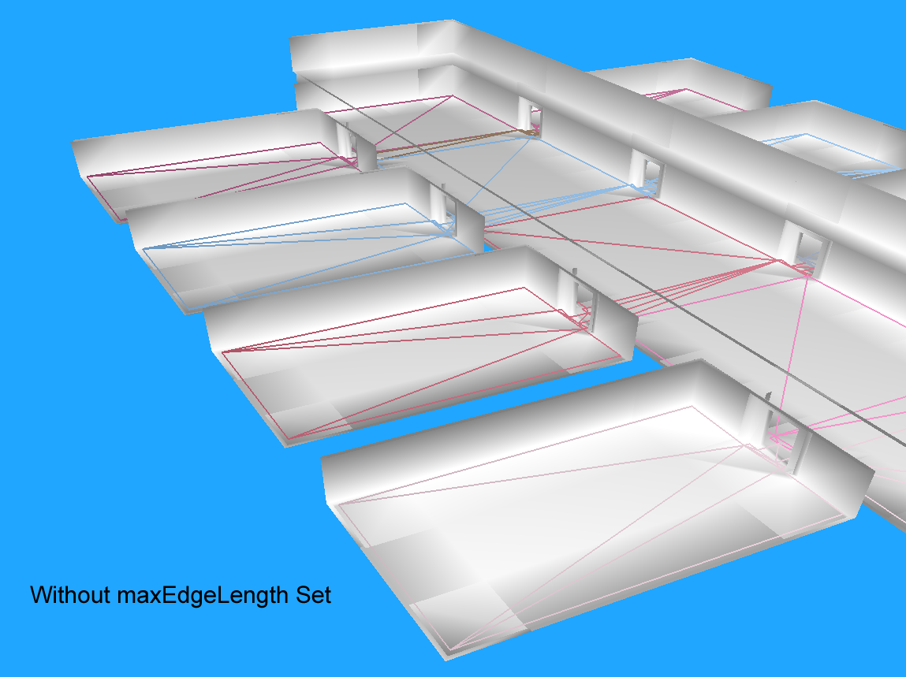
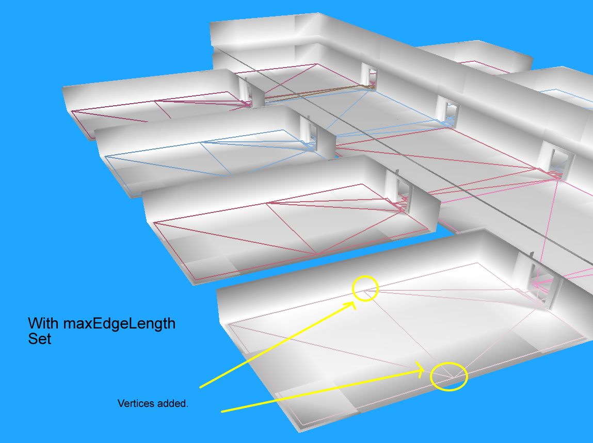

---
至此，我们有了一个形成简单多边形的轮廓。顶点虽然还在体素空间内，但正在回到矢量空间的路上