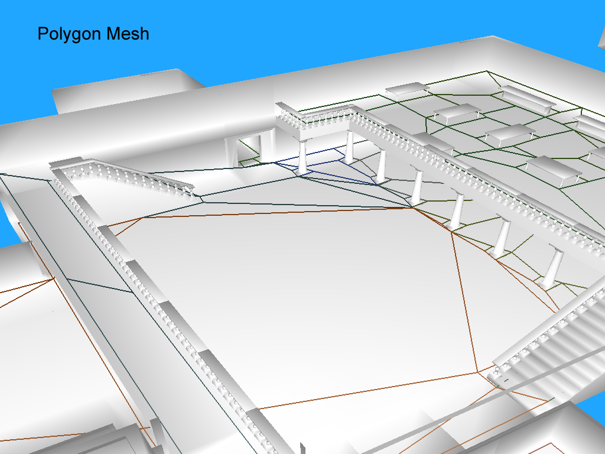

# 凸多边形的生成
这是生成 navmesh 的第四步，从 contour表示的多边形 转换到 凸多边形

---
## 主流程
这个阶段的主流程如下
- contour的顶下是在体素空间下的，所以坐标是基于heightfield原点 并且 坐标也都是整数（因为是描述第几个体素）。所以contour顶点的坐标将被转换回 原始几何体所在的空间
- 由于每个contour都是独立的，所以这个阶段会合并一些重复数据，并放到一张单独的mesh中
- 因为contour只是用来表示简单的多边形，包括了凸多边形和凹多边形。凹多边形在navmesh中没有用（不能穿墙呗）。所以要按需切分来获得凸多边形
- 收集每个多边形边 两侧的多边形 (Polygon neighbor information)

坐标转换 和 顶点合并 这两个步骤比较简单，所以这里就不提了，自己夯代码

这里关注多边形的分解，有如下步骤：
- 对每个contour 进行三角化
- 合并三角形 来尽可能获得较大的三角形

这个阶段将以 连接信息的收集 作为结束

---
## 三角化
遍历contour的顶点，每三个作为一组，即 012、123、234， 判断是不是是不是一个内部三角形。 如果是内部三角形，那么就作为一个候选先放着

三角化的过程如下：
- 找到所有潜在的划分边 （partition / partition edges）

- 找到所有 划分边 中最短的一条，并构建所在的三角形。 同时干掉不会再用的一些 划分边

- 遍历完一圈顶点 同时 确定一些三角形之后，在剩下的多边形中，再来一次，看图吧

---
## Detecting Valid Partitions
有两种算法用来判断 三个顶点构成的三角形 是否可以构成一个有效的内部三角形
- 第一种比较快，可以剔除掉完全在 多边形之外的 划分线
- 如果划分线在多边形内部， 另外一个开销比较大的算法将用来保证 划分线 不会和已经存在的多边形边相交

### The Internal Angle Algorithm
流程如下
- 选定一个三角形，比如下图中的 ABC
- 选定 划分线线段的任一头（比如就A），并沿着 contour 的边做两条射线
- 这里就将以A为圆心的360°分割成两部分，其中开口向着多边形内部的角度 叫做 interior angle，另外一部分（也就是开口向外呗） 叫做 exterior angle
- 如果 划分线线段的另外一头（比如B） 在 interior angle 区域，那么说明由这个 划分线 构成的三角形 在contour的内部
（接下来看看图，会比较直观些）

### The Edge Intersection Algorithm
这个算法相对上面一个，好理解一些

遍历多边形中所有的边，并检查是否 有分割线和其它的相交，如果有的话，这就不是一条合理的分割线

只有上面两个算法都通过后，一条分割线才算是合格的！

---
## Merge into Convex Polygons
这里的合并只会发生于一个 contour 内部，不会出现和另外一个 Contour 中的区域进行合并的情况

一个需要额外注意的点是，这里的合并双方不一定 三角形。脑补下，随着合并进行，到后面都是一块块 凸多边形 互相合并了

宏观的流程如下
- 找到所有可以合并的多边形
- 从这个列表中，选择 公共边最长的 两个多边形 进行合并
- 重复上述操作，直到合并无法继续

两个多边形 可以合并的判断准则：
- 共享一条边
- 合并的结果是凸多边形
- 合并的结果 的边数不能超过配置预设 （maxVertsPerPoly)

判断 “是否有共享边” 和 “合并结果的边数” 比较容易

判断 合并结果是否是凸多边形 有点复杂，关键点是 检查 共享边的两个顶点，如果在合并结果中，两个顶点构成 内部锐角，那么说明 合并结果还是凸多边形

锐角的判断方式如下
- 创建一个 有向参考线，从 当前顶点的上一个顶点 指向 当前顶点的下一个顶点
- 如果 当前顶点在参考线的左侧，那么这个点就构成了 锐角

（夯图吧。。）

这个是失败的情况

---
## 收尾
最后一步就是遍历一遍合并后的 凸多边形，生成一些连接信息

尽管算法的解释优化过了， 但是本质上就是遍历所有原始多边形，然后有共享边的多边形 尝试进行合并

---
到这里，目前的进展有
- 所有数据都已经回到了 矢量空间
- 同时现在的mesh都是凸多边形 （很多算法就可以用上了）
