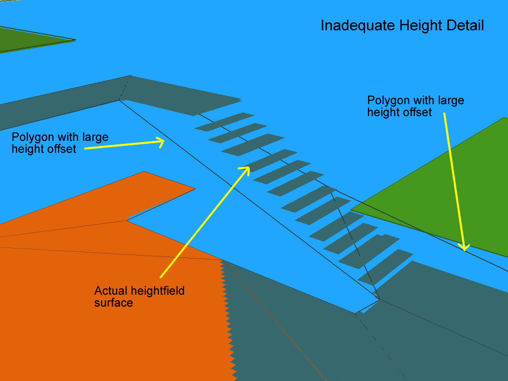

# Detail Mesh Generation

这篇讲述了 构建 navmesh 的第五个阶段（最后一阶段）， 创建 带有高度信息的三角形网格

---
## Why This Step is Performed
如果将 原始几何体的可行走表面 和 上一阶段产出的mesh 投影到xz平面的话，应该是匹配的蛮好的

但是从3D空间来说，上一阶段产出的mesh 在y轴的信息上 是和 contour不匹配的  （这里提示一下，contour就是对体素region的描边）

这一阶段就是把 高度的信息，来使得 产出的mesh在xyz三个方向是都是和 原始几何体表面 匹配的

为了达到这个目的，遍历所有的多边形，在和原始几何体偏离最大的地方插顶点

看下面的例子，台阶附近的mesh在xz平面是匹配的，但是在y轴方向上，偏离较大


添加一个顶点 来补偿高度


```
从 寻路功能 的角度来说，这一步不是必须的。凸多边形的mesh 对寻路算法来说已经够用了，所以上一步产出的凸多边形mesh 提供了所有的必要信息
这一步更多的是为了 在使用 物理、射线时，提供相对准确的数据
事实上，Recast Navigation's Detour 功能库 只用到了凸多边形mesh 来进行寻路
这一章节 添加的高度信息是一个可选的内容，只是用来优化点的位置

同样需要意识到的是，这个步骤只是提供更好的近似 （言外之意就是不可能要像纯物理一样，非常高的精度要求）
体素化的使用 导致了精确的位置信息是不可能的
除此之外，过于详细的高度信息会导致 寻路搜索时的性能和内存开销
```

---
## The Height Patch
这里还会用到前面 体素化的信息（这里很容易理解，所有需要的 原始几何体信息 都需要从体素化后的结构中获取），用来判断偏离度

height patch 包含了每个 open heightfield 中 体素的期望高度

简单来说，height patch 就是一个 open heightfield 的部分信息补充
- 只包含 几何体AABB中的高度信息 （别的信息不管）
- 每个grid （也就是一个 xz 平面中的格子）只保存表面高度 （就是只记录了地面高度，没有span的概念了）
- 每个grid 只有一个高度 （两层楼的搞不定咯？）


---
## The High Level
这一阶段的主要步骤如下，对每个多边形：
- 
-
-

---
## Adding Detail to the Polygon Edges
